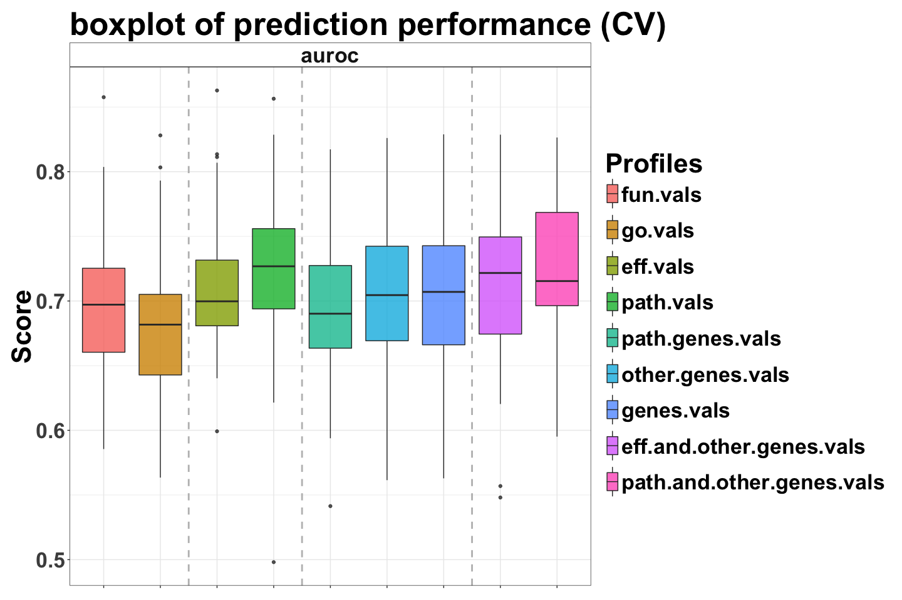

Cancer Prognosis with hiPathia
================
Yunlong Jiao
Apr 15, 2017

-   I. Run prediction
-   II. Prediction performance
    -   Parameter
    -   Predictor tuning
    -   Boxplot
    -   Score and predictor table
    -   Statistical test
-   III. Feature selection
    -   Selection of pathways
    -   Selection of other-genes that complement functional pathways
    -   Top feature table
-   IV. Session info

This notebook reproduces numerical results of the following paper:

> Yunlong Jiao, Marta Hidalgo, Cankut Cubuk, Alicia Amadoz, Jose Carbonell-Caballero, Jean-Philippe Vert, and Joaquin Dopazo. "Signaling Pathway Activities Improve Prognosis for Breast Cancer." Submitted. 2017.

``` r
knitr::opts_chunk$set(error = FALSE, warning = FALSE, message = FALSE, fig.width = 15, fig.height = 10)
options(stringsAsFactors = FALSE)
library(ggplot2)      # produces boxplots
library(igraph)       # processes and plots pathways networks
library(org.Hs.eg.db) # maps entrezID to gene symbol
library(GO.db)        # annotates GO functions
```

I. Run prediction
=================

Parallel script `runPredict.R` on (SGE) cluster by shell script such as `runPredict.sh` with parameters recoded in `runPredict.param.txt`.

We have run this section locally and CV folds predictions are not made available online.

II. Prediction performance
==========================

Parameter
---------

First read in parameters from cluster run and overview the profiles and predictors of interest.

``` r
# read in parameters
param <- read.table("runPredict.param.txt", header = TRUE, row.names = 1)

# features or x
# note for error control: mini.genes.vals is renamed to path.genes.vals!!
xlist <- c(
  "fun.vals", "go.vals", # functionality features
  "eff.vals", "path.vals", # pathway features
  "path.genes.vals", "other.genes.vals", "genes.vals", # gene features
  "eff.and.other.genes.vals", "path.and.other.genes.vals" # mixed type
)
stopifnot(length(setdiff(xlist,unique(param$xname))) == 0)
# preview
knitr::kable(cbind(seq_along(xlist), xlist), caption = "profiles")
```

|     | xlist                     |
|-----|:--------------------------|
| 1   | fun.vals                  |
| 2   | go.vals                   |
| 3   | eff.vals                  |
| 4   | path.vals                 |
| 5   | path.genes.vals           |
| 6   | other.genes.vals          |
| 7   | genes.vals                |
| 8   | eff.and.other.genes.vals  |
| 9   | path.and.other.genes.vals |

``` r
# types
xlist.type <- c(
  "fun.vals" = "func-wise", 
  "go.vals" = "func-wise", # functionality features
  "eff.vals" = "path-wise", 
  "path.vals" = "path-wise", # pathway features
  "path.genes.vals" = "gene-wise",
  "other.genes.vals" = "gene-wise", 
  "genes.vals" = "gene-wise", # gene features
  "eff.and.other.genes.vals" = "mix-wise", 
  "path.and.other.genes.vals" = "mix-wise" # mixed type
)
xlist.vline <- c(2.5, 4.5, 7.5) # cut off types in boxplots

# groups or y
yname <- "surv.grps"
stopifnot(unique(param$yname) == yname)

# predictors
prlist <- unique(param$prname)
# preview
knitr::kable(cbind(seq_along(prlist), prlist), caption = "predictors")
```

|     | prlist              |
|-----|:--------------------|
| 1   | predictorConstant   |
| 2   | predictorGBM        |
| 3   | predictorKendallSVM |
| 4   | predictorKNN        |
| 5   | predictorLDA        |
| 6   | predictorLinearSVM  |
| 7   | predictorLogitLasso |
| 8   | predictorNB         |
| 9   | predictorPAM        |
| 10  | predictorRadialSVM  |
| 11  | predictorRF         |
| 12  | predictorSparseSVM  |

``` r
# (outter) `nfolds`-fold CV repeated `nrepeats` times for evaluation
nfolds <- unique(param$nfolds)
stopifnot(length(nfolds) == 1)
nrepeats <- unique(param$nrepeats)
stopifnot(length(nrepeats) == 1)

# inner `nfolds.inn`-fold CV repeated `nrepeats.inn` times for tuning predictors
nfolds.inn <- unique(param$nfolds.inn)
stopifnot(length(nfolds.inn) == 1)
nrepeats.inn <- unique(param$nrepeats.inn)
stopifnot(length(nrepeats.inn) == 1)

# evaluation measures
slist <- c("auroc")
slist.prefer.large.score <- c("auroc" = TRUE)
```

Predictor tuning
----------------

In order to avoid overfitting with the choice of prediction algorithm used, across each feature `xname` and each each label group `yname` and each outer 5-fold CV repeated 10 times indexed by `i.fold`, the predictor `prname` is selected by nested CV of 5 folds repeated 1 times. The best prediction performance is reported by each evaluation measure `sname`.

We have run this section locally and CV folds evaluation scores are available in `results.scores.txt`.

``` r
# gather scores
scores <- list()
for (i.fold in seq(nfolds*nrepeats)) {
  message("\n", i.fold, "-th fold out of ", nfolds*nrepeats, " folds ", appendLF = FALSE)
  for (xname in xlist) {
    message(".", appendLF = FALSE)
    # get obj
    objname <- paste('res', xname, yname, i.fold, nfolds, nrepeats, sep = '_')
    objpath <- paste0('Robj/',objname,'.RData')
    if (file.exists(objpath)) {
      ivres <- get(load(objpath))
      rm(list = objname)
    } else {
      # read nested cv res
      cvres <- list()
      for (prname in prlist) {
        res.files <- list.files(path = 'Robj', 
                                pattern = paste('^cvres', xname, yname, prname, 
                                                i.fold, nfolds, nrepeats, 
                                                '[[:digit:]]+', nfolds.inn, nrepeats.inn, 
                                                sep = '_'), 
                                full.names = TRUE)
        res <- lapply(res.files, function(f) try(get(load(f))))
        res <- res[sapply(res, function(x) !inherits(x, "try-error"))]
        cvres[[prname]] <- crossValidationCombineResults(res)
      }
      
      # generate iv res where predictor has been selected by nested cv
      ivres <- list()
      for (sname in slist) {
        tt <- sapply(cvres, '[[', "system_time")
        # order scores by increasing system time
        ss <- sapply(cvres, '[[', sname)[order(tt, decreasing = FALSE)]
        stopifnot(!any(is.na(ss)))
        # fast algorithm is preferred among those returning equal score values
        best.prname <- names(ss)[order(ss, decreasing = slist.prefer.large.score[sname])]
        # get iv res NOTE while loop is to guarantee no iv res is found for such predictor
        while (length(best.prname) > 0) {
          best.files <- list.files(path = 'Robj', 
                                   pattern = paste('^ivres', xname, yname, best.prname[1], 
                                                   i.fold, nfolds, nrepeats, 
                                                   '0+', nfolds.inn, nrepeats.inn, 
                                                   sep = '_'), 
                                   full.names = TRUE)
          if (length(best.files) == 0) {
            warning(i.fold, " cv for ", xname, " ", yname, " tuned to best prname ", best.prname[1], " but iv not found")
            best.prname <- best.prname[-1]
            next
          } else if (length(best.files) == 1) {
            best.prname <- best.prname[1]
            best.objname <- gsub("^Robj/|.RData", "", best.files)
            ivres[[sname]] <- get(load(best.files))
            rm(list = best.objname)
            break
          } else {
            stop("multiple ivres files found for ", i.fold, " cv for ", xname, " ", yname, " ", best.prname[1])
          }
        }
        # in case no ivres files found for any predictors
        stopifnot(length(best.prname) == 1)
      }
      
      # save up
      assign(objname, ivres)
      save(list = objname, file = objpath)
      rm(list = c(objname,"cvres"))
    }
    
    # record score values
    scores[[objname]] <- data.frame(
      "y" = yname, 
      "x" = xname, 
      "type" = xlist.type[xname], 
      "predictor" = sapply(slist, function(sname) ivres[[sname]][["predictor"]]), 
      "rep" = i.fold, 
      "score" = slist, 
      "value" = sapply(slist, function(sname) ivres[[sname]][[sname]]), 
      row.names = NULL
    )
    rm(ivres)
  }
}
scores <- do.call('rbind', scores)
rownames(scores) <- seq(nrow(scores))
# write out scores
write.table(scores, file = "results.scores.txt", row.names = TRUE, col.names = TRUE, sep = '\t', quote = TRUE)
```

Boxplot
-------

In the plot, along x-axis we have different feature matrices, along y-axis we have different evaluation measures in `slist`, the boxplots show the variance over scores evaluated against 50 randomly splitted CV folds.

Some evaluation measures (`acc`, `fval`, etc) do associate with a specific `cutoff` threshold for predicted probability, which is always set to constant 0.5. It might be interesting to tune the threshold in case that the class sizes in training data are unbalanced. Note that `auroc` is a parameter-free measure.

``` r
# read scores
scores <- read.table("results.scores.txt", header = TRUE, row.names = 1, sep = '\t')
scores$x <- factor(scores$x, levels = xlist, ordered = TRUE)

# plot
p1 <- ggplot(scores, aes(x = x, y = value)) + 
  geom_boxplot(aes(fill = x), alpha = 0.8) + 
  geom_vline(xintercept = xlist.vline, color = "grey", size = 1, linetype = 2) + 
  facet_wrap(~score, scales = "free") + 
  labs(x = "Profile type", y = "Score") + 
  ggtitle("boxplot of prediction performance (CV)") + 
  theme_bw() + 
  guides(fill = guide_legend(title = "Profiles")) + 
  theme(text = element_text(size = 32, colour = "black", face = "bold"), 
        title = element_text(size = 32, colour = "black", face = "bold"), 
        axis.text.x = element_blank(), 
        axis.title.x = element_blank(), 
        legend.key.height = unit(3, "line"), 
        strip.background = element_rect(fill = "white"), 
        plot.margin = unit(c(1, 1, 1, 1), "lines"))
plot(p1)
```



Score and predictor table
-------------------------

For each evaluation measure `sname`, we report the mean (+/- sd) scores. But as binary classes are unbalanced in most cases, we focus on using `auroc` to evaluate performance. Also this way we also get rid of the effect from tuning cutoff parameter.

In addition we look at which predictor suits well in making prediction using each feature `xname`. We report the top frequently selected predictor across 50 CV runs.

``` r
tab2 <- list()
i <- 1
for (sname in slist) {
  for (xname in xlist) {
    d <- subset(scores, score == sname & x == xname)
    prs <- gsub("^predictor", "", names(sort(table(d$predictor), decreasing = TRUE)))
    tab2[[i]] <- data.frame(
      "score" = sname,
      "profile" = xname,
      "mean" = mean(d$value),
      "sd" = sd(d$value),
      "pr1" = prs[1],
      "pr2" = prs[2],
      row.names = NULL
    )
    i <- i + 1
  }
}
tab2 <- do.call("rbind", tab2)
# preview
knitr::kable(tab2, digits = 4, caption = 'score/predictor table of prediction performance (CV)')
```

| score | profile                   |    mean|      sd| pr1       | pr2       |
|:------|:--------------------------|-------:|-------:|:----------|:----------|
| auroc | fun.vals                  |  0.6962|  0.0544| RadialSVM | GBM       |
| auroc | go.vals                   |  0.6807|  0.0610| RadialSVM | LinearSVM |
| auroc | eff.vals                  |  0.7087|  0.0510| RadialSVM | LinearSVM |
| auroc | path.vals                 |  0.7211|  0.0632| RadialSVM | LinearSVM |
| auroc | path.genes.vals           |  0.6938|  0.0564| RadialSVM | LinearSVM |
| auroc | other.genes.vals          |  0.7075|  0.0525| LinearSVM | RadialSVM |
| auroc | genes.vals                |  0.7075|  0.0527| LinearSVM | RadialSVM |
| auroc | eff.and.other.genes.vals  |  0.7127|  0.0584| LinearSVM | RadialSVM |
| auroc | path.and.other.genes.vals |  0.7246|  0.0536| LinearSVM | RadialSVM |

Statistical test
----------------

Now we look at the significance of the difference in prediction using two feature matrices. For evaluation measure `auroc`, we compute a matrix where each entry indicates the p-value of a one-sided `t.test` testing if using the feature matrix in the row is indeed superior to using the feature matrix in the col.

``` r
# fix evaluation measure sname
sname <- "auroc"
d <- subset(scores, score == sname)
d <- lapply(split(d, d$x), "[[", "value")
# signif test
pmatrix <- matrix(NA, nrow = length(xlist), ncol = length(xlist),
                  dimnames = list(xlist, xlist))
for (i in 1:(length(xlist) - 1)) {
  for (j in (i+1):length(xlist)) {
    pmatrix[i,j] <- t.test(x = d[[xlist[i]]], y = d[[xlist[j]]], alternative = 'two.sided', mu = 0, paired = TRUE)$p.value
  }
}
# correct p-value for multiple testing with Benjamini-Hochberg
pmatrix.adj <- p.adjust(pmatrix, "BH")
attributes(pmatrix.adj) <- attributes(pmatrix)
# preview
knitr::kable(pmatrix.adj, digits = 4, caption = paste0('FDR-adjusted p-values (', sname, ')'))
```

|                           |  fun.vals|  go.vals|  eff.vals|  path.vals|  path.genes.vals|  other.genes.vals|  genes.vals|  eff.and.other.genes.vals|  path.and.other.genes.vals|
|---------------------------|---------:|--------:|---------:|----------:|----------------:|-----------------:|-----------:|-------------------------:|--------------------------:|
| fun.vals                  |        NA|   0.1467|    0.1306|     0.0119|           0.8267|            0.1908|      0.1908|                    0.0815|                     0.0020|
| go.vals                   |        NA|       NA|    0.0024|     0.0004|           0.1557|            0.0120|      0.0119|                    0.0046|                     0.0000|
| eff.vals                  |        NA|       NA|        NA|     0.0815|           0.0255|            0.8743|      0.8743|                    0.6422|                     0.0235|
| path.vals                 |        NA|       NA|        NA|         NA|           0.0046|            0.1408|      0.1394|                    0.3702|                     0.6422|
| path.genes.vals           |        NA|       NA|        NA|         NA|               NA|            0.0255|      0.0255|                    0.0046|                     0.0002|
| other.genes.vals          |        NA|       NA|        NA|         NA|               NA|                NA|      0.9483|                    0.2167|                     0.0039|
| genes.vals                |        NA|       NA|        NA|         NA|               NA|                NA|          NA|                    0.2000|                     0.0032|
| eff.and.other.genes.vals  |        NA|       NA|        NA|         NA|               NA|                NA|          NA|                        NA|                     0.0473|
| path.and.other.genes.vals |        NA|       NA|        NA|         NA|               NA|                NA|          NA|                        NA|                         NA|

``` r
# simplied table by thresholding p-values
thres <- 0.05
# preview
knitr::kable(pmatrix.adj < thres, caption = paste0('Simplified by thresholding p-values at ', thres, ' (', sname, ')'))
```

|                           | fun.vals | go.vals | eff.vals | path.vals | path.genes.vals | other.genes.vals | genes.vals | eff.and.other.genes.vals | path.and.other.genes.vals |
|---------------------------|:---------|:--------|:---------|:----------|:----------------|:-----------------|:-----------|:-------------------------|:--------------------------|
| fun.vals                  | NA       | FALSE   | FALSE    | TRUE      | FALSE           | FALSE            | FALSE      | FALSE                    | TRUE                      |
| go.vals                   | NA       | NA      | TRUE     | TRUE      | FALSE           | TRUE             | TRUE       | TRUE                     | TRUE                      |
| eff.vals                  | NA       | NA      | NA       | FALSE     | TRUE            | FALSE            | FALSE      | FALSE                    | TRUE                      |
| path.vals                 | NA       | NA      | NA       | NA        | TRUE            | FALSE            | FALSE      | FALSE                    | FALSE                     |
| path.genes.vals           | NA       | NA      | NA       | NA        | NA              | TRUE             | TRUE       | TRUE                     | TRUE                      |
| other.genes.vals          | NA       | NA      | NA       | NA        | NA              | NA               | FALSE      | FALSE                    | TRUE                      |
| genes.vals                | NA       | NA      | NA       | NA        | NA              | NA               | NA         | FALSE                    | TRUE                      |
| eff.and.other.genes.vals  | NA       | NA      | NA       | NA        | NA              | NA               | NA         | NA                       | TRUE                      |
| path.and.other.genes.vals | NA       | NA      | NA       | NA        | NA              | NA               | NA         | NA                       | NA                        |

III. Feature selection
======================

``` r
# fix predictor prname
prname <- "predictorRF"

# path-wise profiles to select pathways
pathlist <- c("eff.vals", "path.vals")

# mix-wise profiles to select other.genes (key)
xname.mix <- "path.and.other.genes.vals"
xname.list <- c("other.genes.vals", "path.vals")
xname.key <- "other.genes.vals"

# max number of selected feats from each category
n.max.fs <- 50
```

We are interested in informative features related to phenotypic response. To that end, we use predictorRF to rank feature importance in order to select top 50 pathways from one of eff.vals, path.vals, or top 50 other-genes from path.and.other.genes.vals.

Selection of pathways
---------------------

We have run this section locally and the list of selected pathways are available in `results.pathways.txt`.

``` r
source("../src/func.R")
pathways <- list()
i <- 1
for (xname in pathlist) {
  message('\n featselect for \t', xname, '\n')
  res.files <- list.files(path = 'Robj', 
                          pattern = paste('^ivres', xname, yname, prname, 
                                          '[[:digit:]]+', nfolds, nrepeats, 
                                          0, nfolds.inn, nrepeats.inn, 
                                          sep = '_'), 
                          full.names = TRUE)
  res <- lapply(res.files, function(f) get(load(f)))
  names(res) <- paste0("rep",1:length(res))
  
  # feat.scores as a vector of mean var.imp over cv splits
  fsfunc <- get(gsub("^predictor", "featselect", prname), mode = "function")
  featlist.scores <- lapply(res, function(u){
    message(",", appendLF = FALSE)
    v <- fsfunc(model = u$model, keep.signif = FALSE)
    data.frame(t(v))
  })
  featlist.scores <- colMeans(do.call("rbind", featlist.scores))
  featlist.scores <- sort(featlist.scores, decreasing = TRUE)
  rm(res)
  
  # to write up
  pathways[[i]] <- data.frame(
    "x" = xname,
    "y" = yname,
    "type" = xlist.type[xname],
    "predictor" = prname,
    "rank" = 1:n.max.fs,
    "feat" = names(featlist.scores)[1:n.max.fs],
    "varimp" = featlist.scores[1:n.max.fs],
    row.names = NULL
  )
  i <- i + 1
}
pathways <- do.call("rbind", pathways)
rownames(pathways) <- seq(nrow(pathways))
# write up !
write.table(pathways, file = "results.pathways.txt", row.names = TRUE, col.names = TRUE, sep = '\t')
```

Selection of other-genes that complement functional pathways
------------------------------------------------------------

We have run this section locally and the list of selected other-genes are available in `results.othergenes.txt`.

``` r
source("../src/func.R")
# get full lists of features in each of xname.list
featlist.long <- lapply(xname.list, function(u){
  data.files <- list.files(path = '../data', pattern = u, full.names = TRUE)
  unlist(lapply(data.files, function(f) colnames(get(load(f)))))
})
names(featlist.long) <- xname.list

# load res
res.files <- list.files(path = 'Robj', 
                        pattern = paste('^ivres', xname.mix, yname, prname, 
                                        '[[:digit:]]+', nfolds, nrepeats, 
                                        0, nfolds.inn, nrepeats.inn, 
                                        sep = '_'), 
                        full.names = TRUE)
res <- lapply(res.files, function(f) get(load(f)))
names(res) <- paste0("rep",1:length(res))

# get feat.scores as a vector of mean var.imp over cv splits
fsfunc <- get(gsub("^predictor", "featselect", prname), mode = "function")
featlist.scores <- lapply(res, function(u){
  message(",", appendLF = FALSE)
  v <- fsfunc(model = u$model, keep.signif = FALSE)
  data.frame(t(v))
})
featlist.scores <- colMeans(do.call("rbind", featlist.scores))
featlist.scores <- sort(featlist.scores, decreasing = TRUE)
rm(res)
# split it up to a list of mean var.imp for each type of profile
featlist.scores.split <- lapply(featlist.long, function(u){
  sort(featlist.scores[u], decreasing = TRUE)
})

# reformat other-genes
othergenes <- data.frame(
  "x" = xname.mix,
  "y" = yname,
  "type" = xlist.type[xname.mix],
  "predictor" = prname,
  "rank" = 1:n.max.fs,
  "feat" = names(featlist.scores.split[[xname.key]])[1:n.max.fs],
  "varimp" = featlist.scores.split[[xname.key]][1:n.max.fs],
  row.names = NULL
)
rownames(othergenes) <- seq(nrow(othergenes))
# write up !
write.table(othergenes, file = "results.othergenes.txt", row.names = TRUE, col.names = TRUE, sep = '\t')
```

Top feature table
-----------------

``` r
# load graph data and read in lists of selected features
fpgs <- get(load("../data/fpgs.RData"))
pathways <- read.table("results.pathways.txt", header = TRUE, row.names = 1)
othergenes <- read.table("results.othergenes.txt", header = TRUE, row.names = 1)

# featselect - path
pathlist <- subset(pathways, x == "path.vals", select = c(rank,feat))
pathlist$pathway <- character(n.max.fs)
pathlist$receptor <- character(n.max.fs)
pathlist$effector <- character(n.max.fs)
pathlist$func <- character(n.max.fs)
rownames(pathlist) <- NULL
for (i in seq(nrow(pathlist))) {
  # get path, start and end
  x <- strsplit(sub("^X_", "", pathlist$feat[i]), "_{2,}")[[1]]
  path.id <- x[1]
  start.id <- gsub("_", " ", x[2])
  end.id <- gsub("_", " ", x[3])
  pathlist$feat[i] <- paste0(path.id, " : ", start.id, " - ", end.id)
  # get pathway name
  stopifnot(fpgs[[path.id]][["path.id"]] == path.id)
  pathlist$pathway[i] <- fpgs[[path.id]][["path.name"]]
  # get receptor and effector
  subpath.id <- paste(start.id, end.id, sep = " - ")
  subpath <- fpgs[[path.id]][["subgraphs"]][[subpath.id]]
  e <- as_edgelist(subpath, names = FALSE)
  v <- V(subpath)$label
  pathlist$receptor[i] <- v[setdiff(seq_along(v), e[ ,2])]
  pathlist$effector[i] <- v[setdiff(seq_along(v), e[ ,1])]
  # get effector function
  subpath.func <- fpgs[[path.id]][["subgraphs_funs"]]
  if (paste0(subpath.id,"_func") %in% names(subpath.func)) {
    subpath.func <- subpath.func[[paste0(subpath.id,"_func")]]
    pathlist$func[i] <- V(subpath.func)$label[grep("_func$", V(subpath.func)$name)]
  } else 
    pathlist$func[i] <- NA
}
# preview
knitr::kable(pathlist, caption = paste0("top ", n.max.fs, " path selected from path.vals"))
```

|     rank| feat                         | pathway                              | receptor       | effector               | func                       |
|--------:|:-----------------------------|:-------------------------------------|:---------------|:-----------------------|:---------------------------|
|        1| hsa04066 : 68 - 58           | HIF-1 signaling pathway              | C00338         | EDN1                   | NA                         |
|        2| hsa04064 : 13 - 133          | NF-kappa B signaling pathway         | IL1B           | CXCL2                  | Inflammatory response      |
|        3| hsa04920 : 14 - 6            | Adipocytokine signaling pathway      | LEP            | PTPN11                 | NA                         |
|        4| hsa04110 : 79 - 43 83 84 85  | Cell cycle                           | TTK            | SMC1B SMC3 STAG1 RAD21 | Cell cycle                 |
|        5| hsa04530 : 43 47 - 30        | Tight junction                       | ACTN4 MAGI3    | AKT3                   | Glycogen biosynthesis      |
|        6| hsa04114 : 44 45 - 42        | Oocyte meiosis                       | SKP1 FBXW11\*  | CPEB2\*                | Translation regulation     |
|        7| hsa04066 : 72 - 88           | HIF-1 signaling pathway              | IL6            | BCL2                   | Apoptosis                  |
|        8| hsa04068 : 80 - 66           | FoxO signaling pathway               | IL10           | BNIP3                  | Apoptosis                  |
|        9| hsa04114 : 23 28 - 42        | Oocyte meiosis                       | SKP1 FBXW11    | CPEB2\*                | Translation regulation     |
|       10| hsa04066 : 72 - 53           | HIF-1 signaling pathway              | IL6            | EGF\*                  | NA                         |
|       11| hsa04064 : 13 - 129          | NF-kappa B signaling pathway         | IL1B           | PTGS2                  | Prostaglandin biosynthesis |
|       12| hsa04920 : 14 - 2            | Adipocytokine signaling pathway      | LEP            | C00638                 | NA                         |
|       13| hsa04152 : 86 - 84           | AMPK signaling pathway               | LEP            | LEPR                   | NA                         |
|       14| hsa04010 : 41 - 129          | MAPK signaling pathway               | CACNG3         | FOS                    | NA                         |
|       15| hsa04066 : 72 - 48           | HIF-1 signaling pathway              | IL6            | PFKFB3                 | NA                         |
|       16| hsa04151 : 49 50 - 26        | PI3K-Akt signaling pathway           | HSP90AA1 CDC37 | RBL2                   | Cell cycle                 |
|       17| hsa04015 : 26 - 17           | Rap1 signaling pathway               | RAP1GAP        | ACTB                   | NA                         |
|       18| hsa04066 : 68 - 88           | HIF-1 signaling pathway              | C00338         | BCL2                   | Apoptosis                  |
|       19| hsa04620 : 3 5 - 39          | Toll-like receptor signaling pathway | TRAF6 IRAK4    | IL6                    | Acute phase                |
|       20| hsa04068 : 79 - 46           | FoxO signaling pathway               | IL6            | PLK4                   | Cell cycle                 |
|       21| hsa04520 : 20 - 1 13         | Adherens junction                    | TGFBR1         | SMAD4 SMAD2            | Transcription regulation   |
|       22| hsa04270 : 61 - 10 3 71      | Vascular smooth muscle contraction   | C00547         | ACTA2 MYL9 MYH11       | NA                         |
|       23| hsa04024 : 55 - 21           | cAMP signaling pathway               | C01996         | AKT3                   | Glycogen biosynthesis      |
|       24| hsa04022 : 4 - 65            | cGMP-PKG signaling pathway           | C00533         | PDE2A                  | NA                         |
|       25| hsa04024 : 82 - 21           | cAMP signaling pathway               | C00186         | AKT3                   | Glycogen biosynthesis      |
|       26| hsa04020 : 9 53 - 42         | Calcium signaling pathway            | NOS1 CALML6    | MYLK4                  | NA                         |
|       27| hsa04068 : 79 - 60           | FoxO signaling pathway               | IL6            | RAG1                   | DNA recombination          |
|       28| hsa04068 : 79 - 56           | FoxO signaling pathway               | IL6            | BCL6\*                 | Inflammatory response      |
|       29| hsa04068 : 79 - 50           | FoxO signaling pathway               | IL6            | TNFSF10                | NA                         |
|       30| hsa04024 : 56 - 21           | cAMP signaling pathway               | C00334         | AKT3                   | Glycogen biosynthesis      |
|       31| hsa04066 : 72 - 56           | HIF-1 signaling pathway              | IL6            | TEK                    | Angiogenesis               |
|       32| hsa05200 : 250 - 96          | Pathways in cancer                   | FGF1           | C00416                 | NA                         |
|       33| hsa04024 : 130 - 21          | cAMP signaling pathway               | C20793         | AKT3                   | Glycogen biosynthesis      |
|       34| hsa04270 : 62 - 10 3 71      | Vascular smooth muscle contraction   | C16010         | ACTA2 MYL9 MYH11       | NA                         |
|       35| hsa04024 : 133 - 21          | cAMP signaling pathway               | C00746         | AKT3                   | Glycogen biosynthesis      |
|       36| hsa04024 : 81 - 21           | cAMP signaling pathway               | C16022         | AKT3                   | Glycogen biosynthesis      |
|       37| hsa04024 : 131 - 21          | cAMP signaling pathway               | C00042         | AKT3                   | Glycogen biosynthesis      |
|       38| hsa04024 : 79 - 21           | cAMP signaling pathway               | C16010         | AKT3                   | Glycogen biosynthesis      |
|       39| hsa04270 : 21 - 10 3 71      | Vascular smooth muscle contraction   | PPP1R14A       | ACTA2 MYL9 MYH11       | NA                         |
|       40| hsa05205 : 199 200 - 215 216 | Proteoglycans in cancer              | IGF1 IGF1R     | EIF4B RPS6             | Initiation factor          |
|       41| hsa04520 : 53 56 - 44 52 45  | Adherens junction                    | SSX2IP MLLT4   | ACTB ACTN4 CTNNA1      | Protein transport          |
|  Cell ad| hesion                       |                                      |                |                        |                            |
|       42| hsa04022 : 15 - 65           | cGMP-PKG signaling pathway           | C16005         | PDE2A                  | NA                         |
|       43| hsa04010 : 102 - 129         | MAPK signaling pathway               | IL1A           | FOS                    | NA                         |
|       44| hsa04024 : 129 - 21          | cAMP signaling pathway               | C01089         | AKT3                   | Glycogen biosynthesis      |
|       45| hsa04068 : 79 - 43           | FoxO signaling pathway               | IL6            | CDKN1A                 | Cell cycle                 |
|       46| hsa04068 : 79 - 51           | FoxO signaling pathway               | IL6            | BCL6                   | Inflammatory response      |
|       47| hsa04024 : 80 - 21           | cAMP signaling pathway               | C15949         | AKT3                   | Glycogen biosynthesis      |
|       48| hsa04620 : 11 - 39           | Toll-like receptor signaling pathway | MAP3K8         | IL6                    | Acute phase                |
|       49| hsa04068 : 79 - 45           | FoxO signaling pathway               | IL6            | RBL2                   | Cell cycle                 |
|       50| hsa04151 : 58 - 26           | PI3K-Akt signaling pathway           | CRTC2          | RBL2                   | Cell cycle                 |

``` r
# featselect - eff
efflist <- subset(pathways, x == "eff.vals", select = c(rank,feat))
efflist$pathway <- character(n.max.fs)
efflist$effector <- character(n.max.fs)
efflist$func <- character(n.max.fs)
rownames(efflist) <- NULL
for (i in seq(nrow(efflist))) {
  # get path, start and end
  x <- strsplit(sub("^X_", "", efflist$feat[i]), "_{2,}")[[1]]
  path.id <- x[1]
  start.id <- "X" # just for error control
  end.id <- gsub("_", " ", x[2])
  efflist$feat[i] <- paste0(path.id, " : ", start.id, " - ", end.id)
  # get pathway name
  stopifnot(fpgs[[path.id]][["path.id"]] == path.id)
  efflist$pathway[i] <- fpgs[[path.id]][["path.name"]]
  # get receptor and effector
  subpath.id <- end.id
  subpath <- fpgs[[path.id]][["effector.subgraphs"]][[subpath.id]]
  e <- as_edgelist(subpath, names = FALSE)
  v <- V(subpath)$label
  efflist$effector[i] <- v[setdiff(seq_along(v), e[ ,1])]
  # get effector function
  subpath.func <- fpgs[[path.id]][["effector.subgraphs_funs"]]
  if (paste0(subpath.id,"_func") %in% names(subpath.func)) {
    subpath.func <- subpath.func[[paste0(subpath.id,"_func")]]
    efflist$func[i] <- V(subpath.func)$label[grep("_func$", V(subpath.func)$name)]
  } else 
    efflist$func[i] <- NA
}
# preview
knitr::kable(efflist, caption = paste0("top ", n.max.fs, " eff selected from eff.vals"))
```

|     rank| feat                                              | pathway                                 | effector                                                    | func                     |
|--------:|:--------------------------------------------------|:----------------------------------------|:------------------------------------------------------------|:-------------------------|
|        1| hsa04152 : X - 84                                 | AMPK signaling pathway                  | LEPR                                                        | NA                       |
|        2| hsa04920 : X - 2                                  | Adipocytokine signaling pathway         | C00638                                                      | NA                       |
|        3| hsa05200 : X - 216                                | Pathways in cancer                      | IL6                                                         | Acute phase              |
|        4| hsa04110 : X - 43 83 84 85                        | Cell cycle                              | SMC1B SMC3 STAG1 RAD21                                      | Cell cycle               |
|        5| hsa04620 : X - 39                                 | Toll-like receptor signaling pathway    | IL6                                                         | Acute phase              |
|        6| hsa04520 : X - 1 13                               | Adherens junction                       | SMAD4 SMAD2                                                 | Transcription regulation |
|        7| hsa04920 : X - 6                                  | Adipocytokine signaling pathway         | PTPN11                                                      | NA                       |
|        8| hsa04022 : X - 65                                 | cGMP-PKG signaling pathway              | PDE2A                                                       | NA                       |
|        9| hsa04022 : X - 57                                 | cGMP-PKG signaling pathway              | C00144                                                      | NA                       |
|       10| hsa04530 : X - 30                                 | Tight junction                          | AKT3                                                        | Glycogen biosynthesis    |
|       11| hsa04916 : X - 10                                 | Melanogenesis                           | CAMK2A                                                      | Differentiation          |
|       12| hsa04152 : X - 64                                 | AMPK signaling pathway                  | ACACB                                                       | Fatty acid metabolism    |
|       13| hsa04920 : X - 43                                 | Adipocytokine signaling pathway         | C00162                                                      | NA                       |
|       14| hsa04110 : X - 59 15 16 17 18 19 20               | Cell cycle                              | CDC45 MCM7 MCM6 MCM5 MCM4 MCM3 MCM2                         | DNA replication          |
|       15| hsa04114 : X - 80                                 | Oocyte meiosis                          | CDC25C\*                                                    | Mitosis                  |
|       16| hsa03320 : X - 30                                 | PPAR signaling pathway                  | LPL                                                         | Lipid metabolism         |
|       17| hsa03320 : X - 40                                 | PPAR signaling pathway                  | FABP4                                                       | Transport                |
|       18| hsa03320 : X - 31                                 | PPAR signaling pathway                  | CD36                                                        | Cell adhesion            |
|       19| hsa03320 : X - 10                                 | PPAR signaling pathway                  | PLIN1                                                       | Lipid metabolism         |
|       20| hsa04662 : X - 24                                 | B cell receptor signaling pathway       | FOS                                                         | Transcription regulation |
|       21| hsa04722 : X - 14 32                              | Neurotrophin signaling pathway          | SHC2 GAB1                                                   | Host-virus interaction   |
|       22| hsa03320 : X - 53                                 | PPAR signaling pathway                  | ADIPOQ                                                      | NA                       |
|       23| hsa04350 : X - 20                                 | TGF-beta signaling pathway              | PITX2                                                       | NA                       |
|       24| hsa04110 : X - 60 10 11 12 13 14 9                | Cell cycle                              | CDC6 ORC3 ORC5 ORC4 ORC2 ORC1 ORC6                          | DNA replication          |
|       25| hsa05205 : X - 215 216                            | Proteoglycans in cancer                 | EIF4B RPS6                                                  | Initiation factor        |
|       26| hsa04261 : X - 52                                 | Adrenergic signaling in cardiomyocytes  | MAPK14                                                      | Stress response          |
|       27| hsa04110 : X - 10 11 12 13 14 9 15 16 17 18 19 20 | Cell cycle                              | ORC3 ORC5 ORC4 ORC2 ORC1 ORC6 MCM7 MCM6 MCM5 MCM4 MCM3 MCM2 | DNA replication          |
|       28| hsa05202 : X - 93                                 | Transcriptional misregulation in cancer | PER2                                                        | Biological rhythms       |
|       29| hsa04152 : X - 87                                 | AMPK signaling pathway                  | CD36                                                        | Cell adhesion            |
|       30| hsa04066 : X - 56                                 | HIF-1 signaling pathway                 | TEK                                                         | Angiogenesis             |
|       31| hsa04152 : X - 27                                 | AMPK signaling pathway                  | ADIPOR1                                                     | Fatty acid metabolism    |
|       32| hsa04921 : X - 46                                 | Oxytocin signaling pathway              | C00942\*                                                    | NA                       |
|       33| hsa04261 : X - 39                                 | Adrenergic signaling in cardiomyocytes  | SCN1B                                                       | Ion transport            |
|       34| hsa04350 : X - 48 49                              | TGF-beta signaling pathway              | TGFBR2 TGFBR1                                               | Growth regulation        |
|       35| hsa04010 : X - 79                                 | MAPK signaling pathway                  | HSPB1                                                       | Stress response          |
|       36| hsa04520 : X - 34                                 | Adherens junction                       | RHOA                                                        | Cell division            |
|       37| hsa04611 : X - 49                                 | Platelet activation                     | PIK3R5\*                                                    | Angiogenesis             |
|  Endocyt| osis                                              |                                         |                                                             |                          |
|  Adaptiv| e immunity                                        |                                         |                                                             |                          |
|   Stress| response                                          |                                         |                                                             |                          |
|       38| hsa04114 : X - 41                                 | Oocyte meiosis                          | CPEB2                                                       | Translation regulation   |
|       39| hsa04922 : X - 78                                 | Glucagon signaling pathway              | ACACA                                                       | Fatty acid metabolism    |
|       40| hsa03320 : X - 55                                 | PPAR signaling pathway                  | SCD                                                         | Fatty acid metabolism    |
|       41| hsa04150 : X - 46                                 | mTOR signaling pathway                  | PRKCA                                                       | Angiogenesis             |
|  Adaptiv| e immunity                                        |                                         |                                                             |                          |
|  Biologi| cal rhythms                                       |                                         |                                                             |                          |
|       42| hsa04919 : X - 21 53                              | Thyroid hormone signaling pathway       | THRA C02465                                                 | Transcription regulation |
|       43| hsa04670 : X - 55                                 | Leukocyte transendothelial migration    | RAC2                                                        | NA                       |
|       44| hsa03320 : X - 7                                  | PPAR signaling pathway                  | AQP7                                                        | Transport                |
|       45| hsa04670 : X - 18                                 | Leukocyte transendothelial migration    | CDH5                                                        | Cell adhesion            |
|       46| hsa04152 : X - 78                                 | AMPK signaling pathway                  | CCNA2                                                       | Cell division            |
|       47| hsa05200 : X - 227                                | Pathways in cancer                      | FOXO1                                                       | Apoptosis                |
|       48| hsa04014 : X - 38                                 | Ras signaling pathway                   | MAPK8                                                       | Biological rhythms       |
|       49| hsa04630 : X - 5                                  | Jak-STAT signaling pathway              | MYC                                                         | Transcription regulation |
|       50| hsa04270 : X - 10 3 71                            | Vascular smooth muscle contraction      | ACTA2 MYL9 MYH11                                            | NA                       |

``` r
# featselect - other.genes
genelist <- subset(othergenes, select = c(rank,feat))
rownames(genelist) <- NULL
# get entrez id
genelist$feat <- gsub("^X_", "", genelist$feat)
# get annotations
gene.annot <- select(org.Hs.eg.db, genelist$feat, c("SYMBOL","GENENAME","GO"), "ENTREZID")
gene.annot$ONTOLOGY <- ordered(
  gene.annot$ONTOLOGY, 
  levels = c("MF", "BP")
)
gene.annot <- gene.annot[order(gene.annot$ONTOLOGY), ]
gene.annot$EVIDENCE <- ordered(
  gene.annot$EVIDENCE, 
  levels = c("IEA", "EXP", "IDA", "IPI", "IMP", "IGI", "IEP", "TAS")
)
gene.annot <- gene.annot[order(gene.annot$EVIDENCE), ]
go.annot <- select(GO.db, gene.annot$GO, "TERM", "GOID")
# get gene symbols, names and GO functions (with preferred order of ONTOLOGY and EVIDENCE defined above)
id <- match(genelist$feat, gene.annot$ENTREZID)
genelist$symbol <- gene.annot$SYMBOL[id]
genelist$name <- gene.annot$GENENAME[id]
genelist$func <- go.annot$TERM[match(gene.annot$GO[id], go.annot$GOID)]
# preview
knitr::kable(genelist, caption = paste0("top ", n.max.fs, " other-genes selected from ", xname.mix))
```

|  rank| feat   | symbol    | name                                                   | func                                                                                                          |
|-----:|:-------|:----------|:-------------------------------------------------------|:--------------------------------------------------------------------------------------------------------------|
|     1| 6944   | VPS72     | vacuolar protein sorting 72 homolog                    | DNA binding                                                                                                   |
|     2| 150356 | CHADL     | chondroadherin like                                    | proteinaceous extracellular matrix                                                                            |
|     3| 340273 | ABCB5     | ATP binding cassette subfamily B member 5              | ATP binding                                                                                                   |
|     4| 8543   | LMO4      | LIM domain only 4                                      | enhancer sequence-specific DNA binding                                                                        |
|     5| 4976   | OPA1      | OPA1, mitochondrial dynamin like GTPase                | GTP binding                                                                                                   |
|     6| 84057  | MND1      | meiotic nuclear divisions 1                            | double-stranded DNA binding                                                                                   |
|     7| 65992  | DDRGK1    | DDRGK domain containing 1                              | regulation of intracellular estrogen receptor signaling pathway                                               |
|     8| 2532   | ACKR1     | atypical chemokine receptor 1 (Duffy blood group)      | G-protein coupled receptor activity                                                                           |
|     9| 554    | AVPR2     | arginine vasopressin receptor 2                        | positive regulation of systemic arterial blood pressure                                                       |
|    10| 7203   | CCT3      | chaperonin containing TCP1 subunit 3                   | ATP binding                                                                                                   |
|    11| 1960   | EGR3      | early growth response 3                                | DNA binding                                                                                                   |
|    12| 5876   | RABGGTB   | Rab geranylgeranyltransferase beta subunit             | protein binding                                                                                               |
|    13| 9314   | KLF4      | Kruppel like factor 4                                  | core promoter binding                                                                                         |
|    14| 3872   | KRT17     | keratin 17                                             | positive regulation of cell growth                                                                            |
|    15| 1020   | CDK5      | cyclin dependent kinase 5                              | p53 binding                                                                                                   |
|    16| 22915  | MMRN1     | multimerin 1                                           | calcium ion binding                                                                                           |
|    17| 125    | ADH1B     | alcohol dehydrogenase 1B (class I), beta polypeptide   | alcohol dehydrogenase activity, zinc-dependent                                                                |
|    18| 115939 | TSR3      | TSR3, acp transferase ribosome maturation factor       | maturation of SSU-rRNA                                                                                        |
|    19| 3068   | HDGF      | hepatoma-derived growth factor                         | nucleotide binding                                                                                            |
|    20| 10188  | TNK2      | tyrosine kinase non receptor 2                         | protein serine/threonine kinase activity                                                                      |
|    21| 202333 | CMYA5     | cardiomyopathy associated 5                            | M band                                                                                                        |
|    22| 79174  | CRELD2    | cysteine rich with EGF like domains 2                  | calcium ion binding                                                                                           |
|    23| 811    | CALR      | calreticulin                                           | iron ion binding                                                                                              |
|    24| 130733 | TMEM178A  | transmembrane protein 178A                             | integral component of membrane                                                                                |
|    25| 441531 | PGAM4     | phosphoglycerate mutase family member 4                | bisphosphoglycerate mutase activity                                                                           |
|    26| 7257   | TSNAX     | translin associated factor X                           | sequence-specific DNA binding                                                                                 |
|    27| 22893  | BAHD1     | bromo adjacent homology domain containing 1            | transcription, DNA-templated                                                                                  |
|    28| 1395   | CRHR2     | corticotropin releasing hormone receptor 2             | cell surface receptor signaling pathway                                                                       |
|    29| 467    | ATF3      | activating transcription factor 3                      | transcriptional repressor activity, RNA polymerase II core promoter proximal region sequence-specific binding |
|    30| 50940  | PDE11A    | phosphodiesterase 11A                                  | cAMP binding                                                                                                  |
|    31| 6403   | SELP      | selectin P                                             | glycoprotein binding                                                                                          |
|    32| 221303 | FAM162B   | family with sequence similarity 162 member B           | integral component of membrane                                                                                |
|    33| 400830 | DEFB132   | defensin beta 132                                      | extracellular region                                                                                          |
|    34| 55341  | LSG1      | large 60S subunit nuclear export GTPase 1              | protein transport                                                                                             |
|    35| 3491   | CYR61     | cysteine rich angiogenic inducer 61                    | insulin-like growth factor binding                                                                            |
|    36| 9079   | LDB2      | LIM domain binding 2                                   | enzyme binding                                                                                                |
|    37| 11190  | CEP250    | centrosomal protein 250                                | cilium                                                                                                        |
|    38| 3347   | HTN3      | histatin 3                                             | metal ion binding                                                                                             |
|    39| 80726  | KIAA1683  | KIAA1683                                               | nucleus                                                                                                       |
|    40| 23020  | SNRNP200  | small nuclear ribonucleoprotein U5 subunit 200         | ATP binding                                                                                                   |
|    41| 149647 | FAM71A    | family with sequence similarity 71 member A            | nucleus                                                                                                       |
|    42| 1431   | CS        | citrate synthase                                       | tricarboxylic acid cycle                                                                                      |
|    43| 387914 | SHISA2    | shisa family member 2                                  | multicellular organism development                                                                            |
|    44| 550643 | LINC01420 | long intergenic non-protein coding RNA 1420            | NA                                                                                                            |
|    45| 115207 | KCTD12    | potassium channel tetramerization domain containing 12 | protein homooligomerization                                                                                   |
|    46| 84618  | NT5C1A    | 5'-nucleotidase, cytosolic IA                          | nucleotide binding                                                                                            |
|    47| 126393 | HSPB6     | heat shock protein family B (small) member 6           | structural constituent of eye lens                                                                            |
|    48| 4239   | MFAP4     | microfibrillar associated protein 4                    | cell adhesion                                                                                                 |
|    49| 5709   | PSMD3     | proteasome 26S subunit, non-ATPase 3                   | enzyme regulator activity                                                                                     |
|    50| 401052 | LOC401052 | uncharacterized LOC401052                              | NA                                                                                                            |

IV. Session info
================

``` r
devtools::session_info()
```

    ##  setting  value                       
    ##  version  R version 3.3.2 (2016-10-31)
    ##  system   x86_64, darwin13.4.0        
    ##  ui       X11                         
    ##  language (EN)                        
    ##  collate  C                           
    ##  tz       Europe/Paris                
    ##  date     2017-04-21                  
    ## 
    ##  package       * version date       source        
    ##  AnnotationDbi * 1.36.2  2017-01-30 Bioconductor  
    ##  Biobase       * 2.34.0  2016-10-18 Bioconductor  
    ##  BiocGenerics  * 0.20.0  2016-10-18 Bioconductor  
    ##  DBI             0.6     2017-03-09 CRAN (R 3.3.2)
    ##  GO.db         * 3.4.0   2017-03-30 Bioconductor  
    ##  IRanges       * 2.8.2   2017-03-18 Bioconductor  
    ##  RSQLite         1.1-2   2017-01-08 CRAN (R 3.3.2)
    ##  Rcpp            0.12.10 2017-03-19 CRAN (R 3.3.2)
    ##  S4Vectors     * 0.12.2  2017-03-18 Bioconductor  
    ##  assertthat      0.1     2013-12-06 CRAN (R 3.3.0)
    ##  backports       1.0.5   2017-01-18 CRAN (R 3.3.2)
    ##  colorspace      1.3-2   2016-12-14 CRAN (R 3.3.2)
    ##  devtools        1.12.0  2016-06-24 CRAN (R 3.3.0)
    ##  digest          0.6.12  2017-01-27 CRAN (R 3.3.2)
    ##  evaluate        0.10    2016-10-11 CRAN (R 3.3.0)
    ##  ggplot2       * 2.2.1   2016-12-30 CRAN (R 3.3.2)
    ##  gtable          0.2.0   2016-02-26 CRAN (R 3.3.0)
    ##  highr           0.6     2016-05-09 CRAN (R 3.3.0)
    ##  htmltools       0.3.5   2016-03-21 CRAN (R 3.3.0)
    ##  igraph        * 1.0.1   2015-06-26 CRAN (R 3.3.0)
    ##  knitr           1.15.1  2016-11-22 CRAN (R 3.3.2)
    ##  labeling        0.3     2014-08-23 CRAN (R 3.3.0)
    ##  lazyeval        0.2.0   2016-06-12 CRAN (R 3.3.0)
    ##  magrittr        1.5     2014-11-22 CRAN (R 3.3.0)
    ##  memoise         1.0.0   2016-01-29 CRAN (R 3.3.0)
    ##  munsell         0.4.3   2016-02-13 CRAN (R 3.3.0)
    ##  org.Hs.eg.db  * 3.4.0   2016-11-23 Bioconductor  
    ##  plyr            1.8.4   2016-06-08 CRAN (R 3.3.0)
    ##  rmarkdown       1.4     2017-03-24 CRAN (R 3.3.2)
    ##  rprojroot       1.2     2017-01-16 CRAN (R 3.3.2)
    ##  scales          0.4.1   2016-11-09 CRAN (R 3.3.2)
    ##  stringi         1.1.3   2017-03-21 CRAN (R 3.3.2)
    ##  stringr         1.2.0   2017-02-18 CRAN (R 3.3.2)
    ##  tibble          1.2     2016-08-26 CRAN (R 3.3.0)
    ##  withr           1.0.2   2016-06-20 CRAN (R 3.3.0)
    ##  yaml            2.1.14  2016-11-12 CRAN (R 3.3.2)
